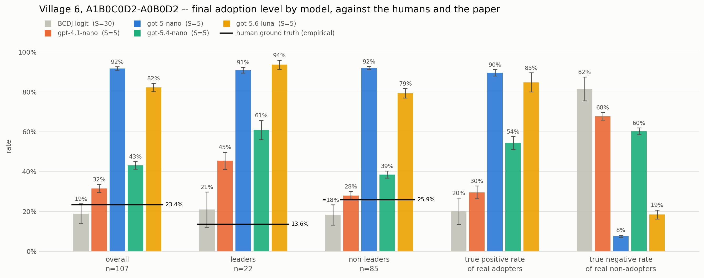

# LLM Agents for Social-Network Diffusion

An agent-based model in which **the agents are LLMs**, simulating how microfinance
spread through **real village social networks** in rural Karnataka, India — and
validated against **what actually happened**.

The setting is the natural experiment behind Banerjee, Chandrasekhar, Duflo &
Jackson (2013), *"The Diffusion of Microfinance," Science* 341(6144):1236498. A
microfinance institution (BSS) entered 43 villages. Before launching, it
privately informed a set of **leaders** — the injection points — and let
participation spread by word of mouth. Because each village's social network had
been mapped ~6 months beforehand, we know both the seeds and the true outcome.
That makes it one of the few diffusion datasets with a real ground truth to score
a simulation against.

## Preview



# HOW TO RUN

Everything is a module run from the repository root, `python -m src.<module>`.
Nothing is installed; the working directory *is* the package root.

## Setup

```bash
pip install -r requirements.txt          # pandas, numpy, matplotlib, networkx, openai, scipy, tqdm
cp keys.example.json keys.json           # then fill in the API keys you actually need
```

`keys.json` carries one credential block per provider — `openai`, `claude`,
`grok` — and is gitignored. The last two are reached through the same OpenAI
client with `base_url` pointed elsewhere, so only the key and the URL differ.
A block you leave blank is simply a model you cannot run; the pilots report it
and skip it rather than failing.

**Data.** The replication bundle is not in the repo (~2 GB). Download *"Social
Networks and Microfinance in Indian Villages"* from the Harvard Dataverse
(linked off https://web.stanford.edu/~jacksonm/Data.html) and unpack it so that
`diffusion-science-data/datav4.0/` sits at the repository root. Check it loads:

```bash
python -m src.data_loader --list                 # villages with a microfinance outcome
python -m src.data_loader --village 6             # one village's network + attributes
```

**Cost.** Every module that calls an API is a **dry run by default** and needs
`--live` to spend money. A dry run renders every prompt and reports its size,
which is the cheap way to check a design before paying for it. Token totals for
anything already run come from `python -m src.pilot.token_costs`.

## 1. Build the inputs

The feature table and the profiles are built once and read by everything after.

```bash
python -m src.tools hh-features --villages 6            # -> output/features/hh_features_6.csv
python -m src.subcaste --villages 6                     # -> output/features/CLEANED_hh_features_6.csv
python -m src.profiler --mode facts --villages 6        # -> output/profiles/profiles_6.json, free
python -m src.profiler --mode story --villages 6 --live # + the LLM narrative per household
```

`--mode facts` is rule-based, instant and costs nothing; `--mode story` adds one
LLM-written narrative per household to the same JSON, so a story file is a
strict superset of a facts file. `output/profiles/profiles_<village>.json` is
the single source of truth for anything profile-shaped. The subcaste step is
optional — village 6's shipped profiles were built from the raw feature table,
not the cleaned one, so keep `--features-dir output/features` to reproduce them.

## 2. The pilots — which prompt design to use

Two prompt-design factorials, each 54 designs over the same two hand-built
samples (a household the paper's model says should join, and one it says should
not). They answer *does this prompt wording separate the two samples*, before
any of it is put in a simulation loop.

```bash
# adoption: does the household join the microfinance programme?
python -m src.pilot.adoption_rate_pilot run --models gpt --reps 20 --live
python -m src.pilot.adoption_rate_pilot report          # Fisher's exact per design, FDR-corrected
python -m src.pilot.adoption_rate_pilot plot --kind fisher
python -m src.pilot.adoption_rate_pilot modules         # each module's own effect on take-up
python -m src.pilot.adoption_rate_pilot dt              # the DT designs: do they obey their own matrix?

# transmission: does an informed household tell this particular neighbour?
python -m src.pilot.transmission_rate_pilot run --models gpt --reps 25 --live
python -m src.pilot.transmission_rate_pilot report
python -m src.pilot.transmission_rate_pilot plot --kind fisher
```

`--models` takes `gpt`, `haiku`, `grok` or a full model id (default: every
model, skipping the ones with no key wired up). `--designs A1B0C1D0 …` runs
named designs instead of the whole grid. Repetitions **stack**: `--reps 20` on
top of an existing 20 gives 40, so re-running to deepen a sample is the normal
move. Logs land in `output/pilot/adoption/` and `output/pilot/transmission/`;
the analysis subcommands (`report`, `plot`, `modules`, `dt`) read those CSVs
and make no API calls.

```bash
python -m src.pilot.token_costs --pilot all             # what the grids cost, per model
```

## 3. The hybrid model — BCDJ transmission, LLM adoption

One run is one village (6 by default). Transmission is BCDJ's own Bernoulli
draw per ordered edge at `qN`/`qP`, transliterated unchanged; only the take-up
decision is an LLM call. That substitution is the entire experiment, which is
what licenses attributing any difference from the BCDJ baseline to it.

```bash
python -m src.hybrid_model.game_master --design A1B0C1D1                     # dry run, no calls
python -m src.hybrid_model.game_master --design A1B0C1D1 --reps 20 --live    # for real
python -m src.hybrid_model.analysis                                          # all three figures
python -m src.hybrid_model.analysis --view leader-split                      # just one
```

`--design` takes one or more adoption-pilot labels. `--seed` sets the base seed
(replicate *r* runs at `seed + r`, in every design, so designs share their
transmission draws), `--reps`/`--first-rep` extend a sample without redoing it,
and `--model` picks the agent. Runs go to `output/hybrid/`, figures to
`figures/hybrid/`. `analysis` scores them against both references: the village's
real take-up, and BCDJ's fitted logit replicated on the same network.

## 4. The full LLM model — both steps are the LLM

Adoption *and* edge-level transmission are LLM calls, with BCDJ's timing kept.
It takes a design pair — one adoption label, one transmission label.

```bash
python -m src.full_llm_model.game_master --adoption A1B0C1D0 --transmission A0B0D2
python -m src.full_llm_model.game_master --adoption A1B0C1D0 --transmission A0B0D2 --reps 20 --live
```

Logs land in `output/full_llm/<model>/<adoption>-<transmission>/`, and the
figures mirror that path exactly under `figures/full_llm/`.

```bash
python -m src.full_llm_model.analysis                              # every folder, all three views
python -m src.full_llm_model.analysis --view timing                # when, not just whether
python -m src.full_llm_model.analysis --pair A1B0C1D0-A0B0D2       # one design pair
python -m src.full_llm_model.model_comparison --pair A1B0C1D0-A0B0D2   # one pair, every model
```

`analysis` holds the model fixed and compares designs; `model_comparison` holds
the design pair fixed and puts one hue per model on one axis, which is only a
comparison at all when the designs are identical.
